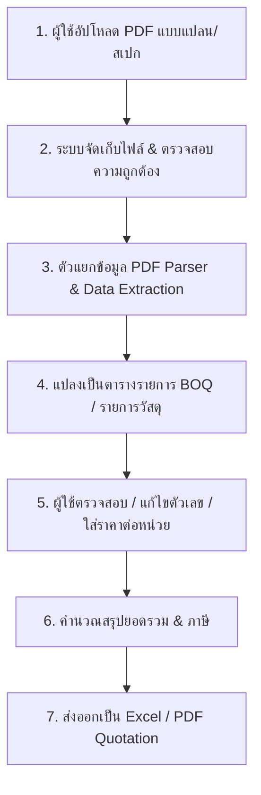

# PDF to BOQ / Quotation (PDF to QOQ) Web Application

โปรเจกต์เว็บแอปพลิเคชันสำหรับแปลงและประมวลผลเอกสารแบบแปลน PDF / รายการสเปกงานก่อสร้าง สู่แบบฟอร์มถอดแบบประมาณราคา (BOQ - Bill of Quantities) และใบเสนอราคา (Quotation) อัตโนมัติ

---

## 📌 ภาพรวมโครงการ (Project Overview)

แอปพลิเคชัน **PDF to QOQ (PDF to Quotation/BOQ)** พัฒนาขึ้นเพื่อช่วยให้วิศวกร, สถาปนิก, และผู้รับเหมาก่อสร้าง สามารถ:
1. **อัปโหลดไฟล์ PDF** (แบบแปลนสถาปัตย์, โครงสร้าง, งานระบบ หรือเอกสารข้อกำหนด)
2. **ดึงข้อมูลรายการวัสดุและปริมาณงาน** (Quantity Takeoff / Data Extraction)
3. **จัดหมวดหมู่หมวดหมู่งาน** ตามมาตรฐานวิศวกรรม (งานโครงสร้าง, งานสถาปัตย์, งานระบบ MEP, งานปรับปรุงภูมิทัศน์)
4. **คำนวณและประเมินราคาค่าแรง + ค่าวัสดุ** พร้อมสรุปยอดรวม
5. **ส่งออกเอกสาร (Export)** เป็นไฟล์ Excel (.xlsx), PDF ใบเสนอราคา หรือบันทึกลงระบบ

---

## 🏗️ โครงสร้างสถาปัตยกรรมระบบ (Architecture)

```
d:\webapp\pdftoqoq\
│
├── markdown\                     # เอกสารโครงการ & ข้อกำหนดเชิงเทคนิค
│   ├── README.md                 # เอกสารภาพรวมโปรเจกต์
│   ├── ARCHITECTURE.md           # โครงสร้างระบบและ Data Flow
│   └── API_SPEC.md               # สเปกการเชื่อมต่อ API / AI Data Extraction
│
├── frontend\                     # หน้าบ้าน (User Interface)
│   ├── index.html                # หน้า Dashboard & Upload
│   ├── app.js                    # ตรรกะการทำงานฝั่ง Client
│   └── styles.css                # การจัดสไตล์ (Tailwind CSS)
│
├── backend\                      # ระบบประมวลผลหลังบ้าน (PHP / API)
│   ├── upload.php                # จัดการไฟล์ PDF ขาเข้า
│   ├── parser.php                # ตัวสกัดข้อความ & ตารางจาก PDF
│   └── export.php                # ส่งออกเป็น Excel / PDF
│
└── uploads\                      # พื้นที่จัดเก็บไฟล์ชั่วคราว
```

---

## 🚀 ขั้นตอนการทำงานของระบบ (Workflow)



---

## 💻 แผนการเชื่อมต่อและติดตั้งบน Exabytes (rpscad.com)

1. **การสร้าง Subdomain บน Plesk:**
   - สร้าง Subdomain เช่น `qoq.rpscad.com` หรือ `boq.rpscad.com`
   - ชี้ไดเรกทอรีไปยังโฟลเดอร์แอปพลิเคชัน
2. **ระบบความปลอดภัย (Security & Privacy):**
   - รองรับการเข้ารหัส SSL/HTTPS อัตโนมัติ
   - กำหนดสิทธิ์โฟลเดอร์ `uploads/` ป้องกันการเข้าถึงไฟล์โดยตรง
   - มีระบบลบไฟล์แคชอัตโนมัติหลังประมวลผลเสร็จสิ้น

---

## 📝 บันทึกการพัฒนา (Changelog & Milestones)
- **Phase 1:** จัดเตรียมโครงสร้าง Markdown & Architecture Specification
- **Phase 2:** พัฒนาหน้า UI สำหรับ Upload & Interactive Data Table
- **Phase 3:** พัฒนาระบบประมวลผล Backend & AI Data Extraction
- **Phase 4:** พัฒนาระบบคำนวณและ Export Excel / PDF
