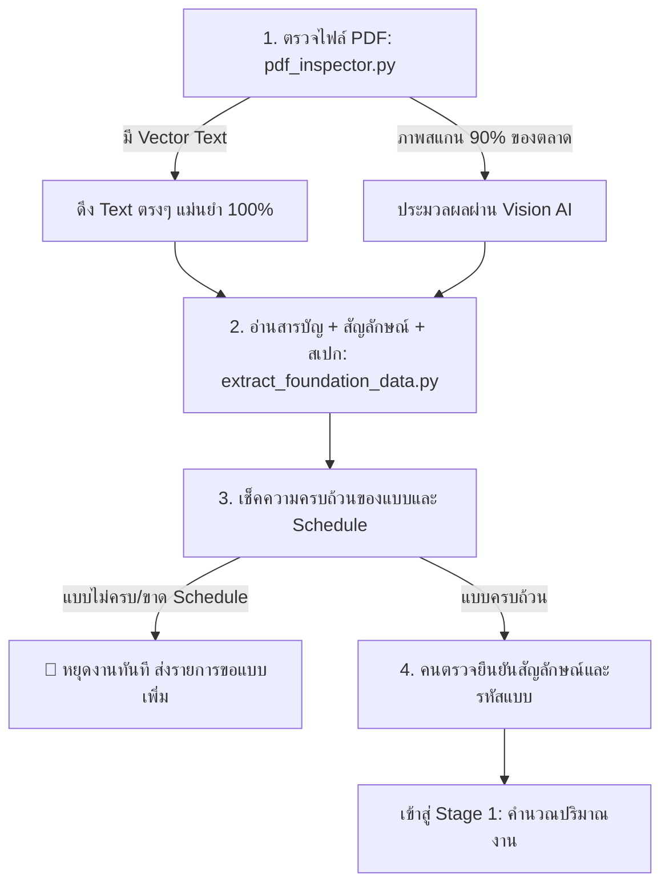

# AI Estimation — Modeling Platform · งานถอดแบบโครงสร้าง
> **เวิร์กโฟลว์มาตรฐานการถอดปริมาณงานโครงสร้างจากแบบก่อสร้าง (Structural Quantity Takeoff Workflow)**  
> สรุปจากงานจริงกับโปรเจกต์ newhouse ใช้เป็นแนวทางซ้ำได้กับแบบอื่น

---

## 🎨 เกณฑ์ความเชื่อมั่นในการประมวลผล (Confidence & Responsibility Level)

| สัญลักษณ์/ระดับ | ความหมาย | ขอบเขตการทำงาน |
| :--- | :--- | :--- |
| 🟢 **AI อ่านแม่น** | เชื่อผลได้เลย | งานอ่านตาราง / แบบขยาย Schedule / สเปกวัสดุ |
| 🟡 **ต้องคนตรวจซ้ำ** | AI มีโอกาสพลาดซ้ำๆ | การนับจำนวนจุดบนผังกริดหนาแน่น / อ่านชื่อห้องรูปทรงซับซ้อน |
| 🔴 **ห้ามเดา** | ไม่มีในแบบ ต้องสำรวจจริง | ระดับดินเดิม, ความสูงตอม่อ, สภาพหน้างานจริง |
| ⚙️ **คำนวณด้วยโค้ด** | Python ล้วน 100% | คำนวณปริมาตรคอนกรีต, น้ำหนักเหล็กเสริม (AI ไม่คิดเลขเอง) |

> 📌 **ขอบเขต:** มุ่งเน้น **"ถอดปริมาณงาน (Quantity Takeoff)"** เป็นหลัก ส่วนการรวม Cutting list และการใส่ราคาจัดเป็นส่วนเสริมท้ายกระบวนการ

---

## 🏗️ Stage 0: เตรียมข้อมูลพื้นฐาน (Foundation Setup)
*ทำครั้งเดียวต่อโปรเจกต์ ก่อนเริ่มนับหรือคำนวณใดๆ ทั้งสิ้น*



### รายละเอียดขั้นตอน Stage 0:
1. **ตรวจไฟล์ (`pdf_inspector.py`)**:
   - ตรวจสอบว่าเป็น Vector PDF หรือ ภาพสแกน (Scanned Bitmap)
   - หากมี Vector Text สามารถดึงข้อความได้ตรงๆ รวดเร็ว ไม่ต้องพึ่ง Vision AI
   - หากเป็นภาพสแกนล้วน (พบ ~90% ในตลาด) ให้ส่งต่อเข้าสาย Vision AI
2. **อ่านข้อมูลพื้นฐาน (`extract_foundation_data.py`)**:
   - ใช้โมเดลอ่านตารางและข้อความหนาแน่นสูง (เช่น Sonnet) สกัดสารบัญ, สัญลักษณ์ และสเปกวัสดุ
   - บันทึกเป็น `foundation_data.md` พร้อมครอปรูปสัญลักษณ์อ้างอิง
3. **เช็คความครบถ้วนของแบบ (Completeness Validation)**:
   - ตรวจสอบรหัสทุกตัวบนผัง (เช่น F1-F3, C1/Cx, B1-B6) เทียบกับตาราง Schedule และแบบขยายจริง
   - **กฎเหล็ก:** หากขาด Schedule หน้าใด *อย่าเพิ่งถอดต่อ* ให้ทำรายการ "แบบที่ขาด" เพื่อขอแบบเพิ่มก่อน
4. **คนตรวจยืนยัน (Human Review & Verification)**:
   - เปิดรูปสัญลักษณ์ที่ครอปไว้ ตรวจสอบความถูกต้องและยืนยันก่อนนำไปใช้อ้างอิง

---

## 📐 Stage 1: คำนวณปริมาณงาน (Quantity Computation)
*แยกสายการคำนวณตามลักษณะการอ้างอิงตำแหน่งของโครงสร้าง*

```
                             [จุดแตกสายของโครงสร้าง]
                                        │
           ┌────────────────────────────┴────────────────────────────┐
           ▼                                                         ▼
[เส้นทาง A: มีกริดอ้างอิงตำแหน่ง]                         [เส้นทาง B: ไม่มีกริดอ้างอิง]
(ฐานราก, ตอม่อ-เสา, คาน, โครงสร้างหลังคา)                             (งานพื้น)
```

---

### 🔹 เส้นทาง A: มีกริดอ้างอิง (ฐานราก · ตอม่อ-เสา · คาน · โครงสร้างหลังคา)
*(ไม่รวมแผ่นมุงหลังคา — จัดเป็นงานสถาปัตย์ / Architectural Finish)*

1. **อ่านผัง (Plan Reading):**
   - อ่านแบบผังโครงสร้างหาตำแหน่งและรหัสบนกริด (เช่น S-01 ฐานราก/ตอม่อ, S-02 คาน, ผังโครงหลังคา แป/จันทัน)
   - ⚠️ ซูมภาพความละเอียด 350-500 dpi **นับซ้ำด้วยตาเสมอ** ป้องกัน AI นับจุดกริดหนาแน่นพลาด
2. **เปิดตาราง Schedule:**
   - อ่านขนาดหน้าตัดและเหล็กเสริมจากตาราง Schedule (เช่น S-05/S-06/S-08) มีความแม่นยำสูง
3. **ถามข้อมูลหน้างาน (Site Constraints):**
   - 🔴 ระดับดินเดิม, ความสูงตอม่อจริง ต้องตรวจสอบจากไซต์งานจริง ห้ามตั้งค่า Default เอง
4. **คำนวณด้วยโค้ด (Deterministic Code Calculation):**
   - คำนวณปริมาตรคอนกรีตและเหล็กเสริมด้วย Python ล้วน แยกตามรายการย่อย ตรวจสอบย้อนกลับได้ทุกจุด
   - สคริปต์ที่ใช้: `extract_footing_boq.py`, `extract_pier_column_boq.py`, `extract_beam_boq.py`

---

### 🔹 เส้นทาง B: ไม่มีกริดอ้างอิง (งานพื้น)

1. **ข้อควรระวังสำคัญ:**
   - 🔴 **ห้ามใช้กริดคาน/เสาสมมติขนาดห้องเด็ดขาด** เนื่องจากผนังภายในมักไม่ตรงกับกริดโครงสร้าง
2. **ไล่เส้นบอกระยะ (Dimension Tracking):**
   - เปิดแบบสถาปัตย์ (A-0x) ไล่เส้นประบอกระยะ (Extension Lines) จากมุมผนังรอบอาคารด้วยตา
3. **ยืนยันตารางห้อง (Room Confirmation):**
   - จัดทำตารางห้อง (Room Schedule) และยืนยันกับเจ้าของงาน โดยเฉพาะห้องรูปตัว L หรือห้องที่เปลี่ยนระบบพื้นกลางห้อง
4. **คำนวณด้วยโค้ด:**
   - นำตารางห้อง (`ROOM_LIST`) ป้อนเข้าสคริปต์ `extract_floor_boq.py` เพื่อคำนวณพื้นที่และปริมาตรคอนกรีต/เหล็ก

---

## 📊 หลักการนำเสนอข้อมูล (Presentation Principles)

> **"ตารางปริมาณต้องแยกรายการย่อย (Itemized) ไม่รวมข้ามหมวด"**

- แต่ละ Item ย่อย (เช่น *F1 ใช้ DB12 กี่เส้น น้ำหนักเท่าไร*) ต้องแสดงแยกตามที่ถอดจริง เพื่อความโปร่งใสและตรวจสอบได้บรรทัดต่อบรรทัด
- การรวมเหล็กและบริหารเศษของเสียเป็นหน้าที่ของ **Cutting List** ในส่วนเสริม

---

## 🧩 ส่วนเสริม (Extensions — ไม่ใช่แกนหลักของการถอดปริมาณ)

1. **บริหารงานก่อสร้าง (`combine_cutting_list.py`):**
   - รวม Cutting List เหล็กเสริมข้ามทุกหมวดงานทั้งโครงการ เพื่อลดเศษของเสียในการสั่งซื้อเหล็กจริง
2. **งานสอบเทียบ (`read_ground_truth_boq.py`):**
   - เปรียบเทียบกับ BOQ จริงที่มีอยู่เดิมเพื่อ Validate ผลลัพธ์
3. **ประเมินราคา (Cost Estimation):**
   - นำตารางปริมาณงานมาจับคู่กับฐานราคาวัสดุและค่าแรงต่อหน่วย (Unit Cost)

---

## 📁 สรุปรายการสคริปต์ทั้งหมด (Script Manifest)

| ไฟล์สคริปต์ | ขั้นตอนที่ใช้งาน | รายละเอียดและหน้าที่ |
| :--- | :--- | :--- |
| `pdf_inspector.py` | **Stage 0** | ตรวจสอบประเภทไฟล์ PDF (Vector Text vs Scanned Bitmap) |
| `extract_foundation_data.py` | **Stage 0** | อ่านสารบัญ สัญลักษณ์ สเปก และตรวจสอบความครบถ้วนของแบบ |
| `extract_footing_boq.py` | **Stage 1 (เส้นทาง A)** | ถอดปริมาณงานฐานราก (Footing) |
| `extract_pier_column_boq.py` | **Stage 1 (เส้นทาง A)** | ถอดปริมาณงานตอม่อและเสา (Pier & Column) |
| `extract_beam_boq.py` | **Stage 1 (เส้นทาง A)** | ถอดปริมาณงานคาน (Beam) |
| `extract_floor_boq.py` | **Stage 1 (เส้นทาง B)** | ถอดปริมาณงานพื้น (Floor Slab - อาศัย `ROOM_LIST`) |
| `combine_cutting_list.py` | **ส่วนเสริม** | รวมรายการตัดเหล็ก (Cutting List) ข้ามทุกหมวดงาน |
| `read_ground_truth_boq.py` | **ส่วนเสริม** | อ่านและเปรียบเทียบผลลัพธ์กับ Ground Truth BOQ |
